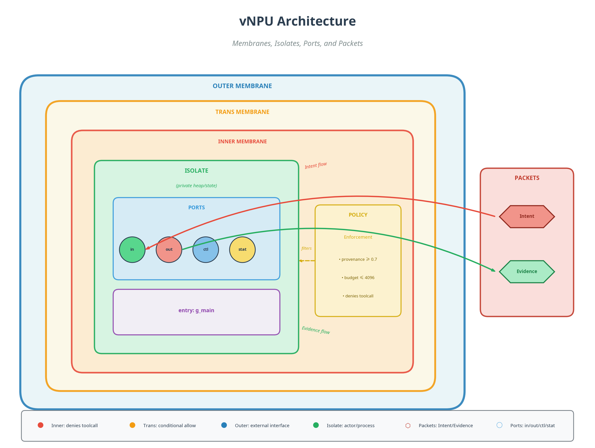

# vNPU - Virtual Neural Processing Unit

A membrane-bound neural substrate architecture for portable AI/ML execution across Plan9/Inferno/WorkerD/V8 environments.



## Overview

vNPU defines a small core language (IDL + IR) for neural computation with strong isolation guarantees through a biological membrane metaphor. The architecture enforces security boundaries while enabling efficient tensor operations across heterogeneous devices.

## Core Concepts

### Membranes

Three-layer isolation model inspired by cellular biology:

| Membrane | Role | Default Policy |
|----------|------|----------------|
| **inner** | Core computation | Denies external toolcalls |
| **trans** | Conditional gateway | Allows with provenance/budget checks |
| **outer** | External interface | 9P/Styx communication |

### Isolates

Actor/process units with:
- Private heap/state
- Membrane binding
- Entry point (graph)
- Typed ports

### Ports

Typed channels for inter-isolate communication:
- `in` / `out` - Data flow
- `ctl` - Control signals
- `stat` - Status/telemetry

Port types: `Intent`, `Evidence`, `Tensor`, `Bytes`

### Packets

Message units that flow through ports:
- **IntentPacket** - Inbound requests/commands
- **EvidencePacket** - Outbound results/proofs

## Project Structure

```
vnpu/
├── CLAUDE.md            # AI development guide
├── DTECHO.md            # Deep Tree Echo ecosystem integration
├── grammar/
│   └── Vnpu.g4          # ANTLR4 grammar (IDE/tooling)
├── src/
│   └── parser/
│       ├── vnpu.l       # Lex tokenizer (Plan9/Inferno)
│       ├── vnpu.y       # Yacc parser (Plan9/Inferno)
│       └── Makefile     # Build system
├── examples/
│   └── hello.vnpu       # Example program
├── docs/
│   └── vnpu_concepts.md # Detailed concept documentation
└── assets/
    ├── vnpu_architecture.png
    └── vnpu_architecture.svg
```

## Example

```vnpu
vnpu v1;

device gpu0 { kind=cuda; sm=80; }

tensor x : f16[1,128,4096] @gpu0;
tensor w : f16[4096,4096]  @gpu0;
tensor y : f16[1,128,4096] @gpu0;

kernel k0 = aten.matmul(x,w) -> y;

policy mem {
  membrane inner denies toolcall;
  membrane trans allows evidence when provenance>=0.7;
}

graph g_main { k0; }

isolate core {
  membrane=inner;
  entry g_main;
}
```

## Grammar Targets

| Target | Use Case |
|--------|----------|
| **ANTLR4** | IDE support, linting, rapid iteration |
| **lex/yacc** | Minimal runtime, Plan9/Inferno native |
| **Z++/formal** | Invariants, type safety, security proofs |

## Integration

The vNPU manifests in Plan9/Inferno as:
- `/dev/vnpu/*` device files
- Styx/9P services
- Isolates as processes/namespaces

## Deep Tree Echo Integration

vNPU supports the Deep Tree Echo (DTEcho) ecosystem for recursive consciousness substrates:

- **Echo Layers** map to vNPU membranes
- **Branch Nodes** implemented as trans-membrane isolates
- **Leaf Kernels** execute in inner membranes

See [DTECHO.md](DTECHO.md) for full ecosystem documentation.

## Related

- [ATen/PyTorch](https://pytorch.org/) - Tensor operations
- [Plan 9](https://9p.io/plan9/) - Distributed OS
- [Inferno](https://www.vitanuova.com/inferno/) - Portable OS
- [GGML](https://github.com/ggerganov/ggml) - Tensor library

## License

MIT
